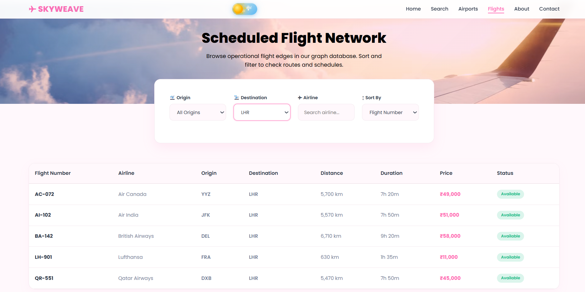

<div align="center">

# ✈️ SKYWEAVE

## Smart Airline Route Planning System

### Optimizing Air Travel Through Graph Algorithms & Full Stack Technologies

<p>


</p>

<p>
A full-stack airline route planning platform that finds optimized flight paths using advanced graph algorithms with a modern interactive interface.
</p>

</div>


---

# 🌍 Overview

**SkyWeave** is a full-stack Airline Route Planner designed to simplify flight route discovery and optimization.

The system models airports as **vertices** and flights as **weighted edges** in a graph structure. Users can search and compare routes based on:

- 📍 Minimum Distance
- 💰 Lowest Cost
- ⏱ Minimum Travel Duration

The application combines a **Java-based graph algorithm engine**, **Node.js backend**, **MySQL database**, and a responsive frontend to provide an efficient route planning experience.


---

# ✨ Features

## 👤 User Features

- ✈ Search optimized flight routes
- 🌎 Browse airport directory
- 🛫 Explore available flights
- 💰 Find cheapest routes
- 📍 Find shortest routes
- ⏱ Find fastest routes
- 🔎 Smart airport search suggestions
- 🌙 Dark / Light theme support
- 📱 Responsive interface
- 🎨 Glassmorphism based modern UI


## 🔐 Admin Features

- Secure admin authentication
- JWT protected routes
- Password encryption using bcrypt
- Airport management
- Flight management
- Flight status updates
- Route history tracking
- Dashboard analytics


---

# 📸 Project Screenshots


## 🏠 Home Page

<p align="center">

</p>


## 🔍 Route Search

<p align="center">

</p>


## 🛫 Airports Directory

<p align="center">

</p>


## ✈ Flight Network

<p align="center">

</p>


## ℹ About Page

<p align="center">

</p>


## 📞 Contact Page

<p align="center">

</p>


## 📊 Admin Dashboard

<p align="center">

</p>


---

# 🏗️ System Architecture


```
                USER
                 |
                 |
                 ▼

       HTML + CSS + JavaScript
              FRONTEND

                 |
                 |
             REST APIs

                 |
                 ▼

        Node.js + Express.js
             BACKEND

          /             \

         /               \

        ▼                 ▼

 MySQL Database     Java Graph Engine


                       |
                       |
              Graph Algorithms

        Dijkstra | BFS | DFS | Prim


```


---

# 🔄 Project Workflow


```
User Selects Source & Destination Airport

                |
                ▼

Frontend Sends Route Request

                |
                ▼

Node.js Express Backend Receives Request

                |
                ▼

Fetch Airport & Flight Data From MySQL

                |
                ▼

Convert Flight Network Into Weighted Graph

                |
                ▼

Send Graph Data To Java Engine

                |
                ▼


        Execute Algorithm

        ┌───────────────┐
        │   Dijkstra    │
        │      BFS      │
        │      DFS      │
        │     Prim      │
        └───────────────┘


                |
                ▼

Java Returns Optimized Route JSON

                |
                ▼

Backend Processes Result

                |
                ▼

Store Search History In MySQL

                |
                ▼

Display Route Details On Website

```


---

# 🧠 Algorithms Implemented


## Dijkstra's Algorithm

Used for finding:

- Shortest distance route
- Cheapest route
- Fastest route


## Breadth First Search (BFS)

Used for:

- Checking connectivity
- Finding reachable airports


## Depth First Search (DFS)

Used for:

- Graph traversal
- Network exploration


## Prim's Algorithm

Used for:

- Minimum spanning tree generation
- Flight network analysis


---

# ⚙️ Technology Stack


| Category | Technology |
|---|---|
| Frontend | HTML5, CSS3, JavaScript |
| UI Design | Bootstrap 5, Custom CSS |
| Backend | Node.js, Express.js |
| Database | MySQL |
| Graph Engine | Java |
| Algorithms | Dijkstra, BFS, DFS, Prim |
| Authentication | JWT + bcrypt |
| API Communication | REST APIs |
| Java Integration | Node child_process |


---

# 📂 Project Structure


```
SkyWeave

│
├── assets
│   └── screenshots
│
├── database
│   └── airline_route_planner.sql
│
├── java-engine
│   ├── models
│   ├── algorithms
│   ├── services
│   └── Main.java
│
├── backend
│   ├── config
│   ├── controllers
│   ├── routes
│   ├── middleware
│   ├── services
│   └── server.js
│
├── web
│   ├── css
│   ├── js
│   ├── images
│   └── pages
│
└── README.md

```


---

# 🚀 Installation & Setup


## 1. Clone Repository


```bash
git clone https://github.com/chhavss/SkyWeave.git
```


## 2. Navigate Into Project


```bash
cd SkyWeave
```


---

# 🗄 Database Setup


1. Open MySQL Workbench

2. Create database:

```sql
CREATE DATABASE airline_route_planner;
```

3. Import:

```
database/airline_route_planner.sql
```


---

# 🔧 Backend Setup


Navigate:

```bash
cd backend
```


Install dependencies:

```bash
npm install
```


Create `.env` file:


```
DB_HOST=localhost
DB_USER=root
DB_PASSWORD=your_password
DB_NAME=airline_route_planner

JWT_SECRET=your_secret_key
PORT=5000

```


Start server:


```bash
npm start
```


Backend runs on:


```
http://localhost:5000
```


---

# ☕ Java Engine Setup


Navigate:

```bash
cd java-engine
```


Compile:

```bash
javac -d bin models/*.java algorithms/*.java services/*.java Main.java
```


The backend communicates with this engine using:

```
Node.js child_process.spawn()
```


The Java module receives JSON input and returns JSON output.


---

# 🔐 Security


Implemented security features:

- JWT based authentication
- bcrypt password hashing
- Protected admin APIs
- Input validation
- Secure database connection


---

# 📊 Database Design


Main tables:


| Table | Purpose |
|-|-|
| Airport | Stores airport information |
| Flight | Stores flight routes and weights |
| Admin | Stores encrypted admin credentials |
| RouteHistory | Stores route searches |


---

# 🌟 Highlights


✔ Full-stack implementation  
✔ Custom graph engine  
✔ Real-world route optimization  
✔ REST API architecture  
✔ Secure authentication  
✔ Modern responsive UI  
✔ Database driven application  


---

# 🔮 Future Enhancements


- Live flight API integration
- Interactive world map
- User accounts
- Saved routes
- Flight booking module
- AI based route prediction
- Real-time flight tracking


---

# 👨‍💻 Author


## Chhavi

GitHub:
https://github.com/chhavss


LinkedIn:
https://linkedin.com/in/chhavi-31418231b


---

<div align="center">

## ✈️ Making Air Travel Simpler, Smarter & More Efficient

⭐ If you like this project, consider giving it a star!

Made with ❤️ using Java, Node.js, MySQL & Web Technologies

</div>
